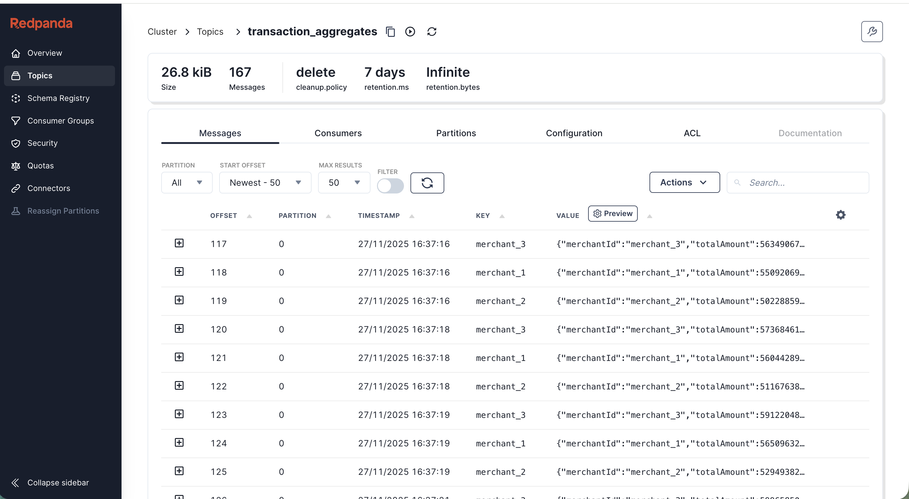

# Développement d'un pipeline kafka -> spark -> kafka

### L'objectif est de traiter en temps réel des données d'un topic vers un autre topic en faisant des aggrégats. Ces derniére vont pouvoir étre consommées par des outils comme ELK pour la visualisation et faire du dashboarding en real time

A cet effet, on met en place une architecture hautement disponible et scalable.

## Description :
Dans cette architecture, on note deux producers java et python, qui vont envoyer des événements vers le topic financials_transactions, et pour assurer la haute disponibilité, on choisit de mettre 3 controllers et 3 brokers. Il faut noter que depuis la version 4.0.0 de kafka, le gestionnaire des métadatas d'un cluster kafka est par defaut KRfat. Ceci nous permet de diminuer le nombre de serveur en maintenance et offre une latence meilleure par rapport à Zookeeper.
En utilisant schema registry, on s'assure du schéma des données et de leur fiabilité, pour garder un format précis.
La console RedPanda, nous permet de monitorer nos topics, en terme de partition, message, offset et du nombre de stockage qu'ils générent.
Un master spark , distrubue la charge et coordonne les workers.
Un traitement d'aggregat sera effectue et transformer les données en amont vers un autre topic.
### For python Producer
Before writting script , install package kafka

<code> pip install confluent-kafka </code>

1000 enregistrement par seconde dans un premier temps

Pour spark processor , il faut d'abord commencer par installer pyspark
<code>pip install pyspark </code>
## Aprés production
L'image nous montre la réussite de l'envoie des messages.

commande pour spark-submit

<code>docker exec spark-master \
  /opt/spark/bin/spark-submit \
  --master spark://spark-master:7077 \
  --conf spark.jars.ivy=/opt/spark/.ivy2/cache \
  --packages org.apache.spark:spark-sql-kafka-0-10_2.12:3.5.0 \
  /opt/spark/work-dir/jobs/spark_processor.py
</code>

Aprés cette commande, on voit que le traitement c'est bien passé
